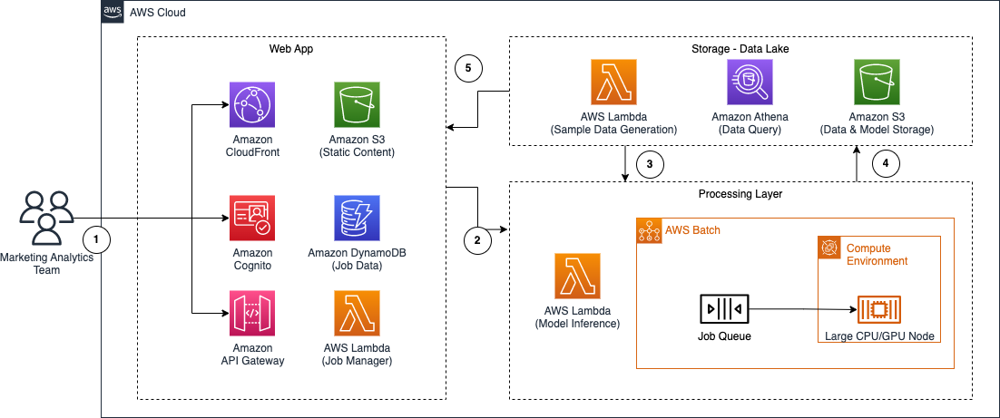

# Mixed Media Modelling Portal On AWS

Mixed Media Modelling Portal on AWS provides a web frontend that allows users to train MMM models quickly and cost effectively. Adminstrators can deploy this solution empowering analytics teams to self serve large levels of compute within the guardrails of services such as AWS Batch to remove the heavy lifting of managing infrastructure. For more information, please refer to <THIS BLOG POST>

## Architecture

It's an architecture built on AWS managed services, eliminating the need for infrastructure management. All the components are serverless with no requirement for pre provisioned unmanaged infrastructure.



###### Frontend Web Application
We use [Amazon CloudFront](https://aws.amazon.com/cloudfront/) and [Amazon S3](https://aws.amazon.com/s3/) to provide a simple, cost-effective way to serve a React based front end with [Amazon Cognito](https://aws.amazon.com/cognito/) providing authentication and authorization to control access. The combination of [Amazon API Gateway](https://aws.amazon.com/api-gateway/), [AWS Lambda](https://aws.amazon.com/lambda/) and [Amazon DynamoDB](https://aws.amazon.com/dynamodb/) provide a Job Manager function exposed as a REST API that can be called by the web application.

###### Storage / Data Lake
By leveraging [Amazon Athena](https://aws.amazon.com/athena/) and [S3](https://aws.amazon.com/s3/), a data lake allows team members to prepare variations of the model input data using standard SQL Queries. We also have a [Lambda](https://aws.amazon.com/lambda/) function that contains code to generate sample data that is a feature of the [LightweightMMM](https://github.com/google/lightweight_mmm) framework.

###### Processing
The processing layer provides the compute required to both train the model’s and run inference requests. By leveraging [AWS Batch](https://aws.amazon.com/batch/), we create a number of different job types, queues and compute environments to allow training the model on Small / Medium and Large GPU/CPU instances, this allows us to expose a simple job submission system via the web front end while using [Batch](https://aws.amazon.com/batch/) to manage the complexity of the underlying compute infrastructure. The trained jobs are saved into the S3 bucket with the Data Lake and we use [Lambda](https://aws.amazon.com/lambda/) to expose inference requests on these trained models.


## Prerequisites for development environment

**NOTE**: We recommend that you follow the steps in the next section to set up your development environment.

- Install [AWS CLI](https://docs.aws.amazon.com/cli/latest/userguide/install-cliv2.html) and [Set configuration and credentials](https://docs.aws.amazon.com/cli/latest/userguide/cli-configure-files.html)
- Install [Python 3](https://www.python.org/about/)
- Install [Node.js LTS](https://nodejs.org/en/)
- Install [Docker Desktop](https://www.docker.com/products/docker-desktop/)

## Set up your development environment using AWS Cloud9

**NOTE**: We recommend you create your AWS Cloud9 environment in `us-east-1` (N. Virginia) region.

**NOTE**: If you are going to create an AWS Cloud9 environment using the following commands, the prerequisites above (e.g. AWS CLI / Python / Node.js / Docker) are pre-configured at Cloud9.

1. Launch [AWS CloudShell](https://docs.aws.amazon.com/cloudshell/latest/userguide/welcome.html) and run the following command.

```sh
git clone https://github.com/aws-samples/cloud9-setup-for-prototyping
cd cloud9-setup-for-prototyping
```

2. Launch Cloud9 environment `cloud9-for-prototyping`

```sh
./bin/bootstrap
```

3. Open the [AWS Cloud9 console](https://console.aws.amazon.com/cloud9/), and open an environment named `cloud9-for-prototyping`.
4. On the menu bar at the top of the AWS Cloud9 IDE, choose `Window` > `New Terminal` or use an existing terminal window.
5. In the terminal window, enter the following.

```sh
git clone https://github.com/aws-samples/mixed-media-model-portal.git
```

6. Go to `mixed-media-model-portal` directory.

```sh
cd mixed-media-model-portal/
```

## Deploy the application

**NOTE**: The following command uses `us-east-1` (N. Virginia) region.

**NOTE**: We recommend that you use the Cloud9 environment for the following steps.

### 1. Frontend React Web App

First we need to build the source code for our React frontend web application

In the terminal window of Cloud9 IDE, enter the following.

```sh
## Build the frontend CDK stack
cd src/frontend
npm install
npm run build
```

### 2. Deploy all services

Now we use CDK to deploy the required services

First we need to go to the CDK folder and create a virtual python environment

```sh
cd ../../infra
$ python3 -m venv .venv
```

After the init process completes and the virtualenv is created, you can use the following
step to activate your virtualenv.

```sh
$ source .venv/bin/activate
```

Once the virtualenv is activated, you can install the required dependencies.

```sh
$ pip install -r requirements.txt
```

Now we can deploy CDK which contains multiple stacks

```sh
cdk deploy --all --require-approval never
```

- After finishing the above command, you will need to find the output of the following parameters
    - HpcBlogFrontendApiEndpoint
    - ExportsOutputRefHpcBlogUserPool
    - If you miss out these outputs, you can check them from the outputs tab of the stacks named `FrontendWebStack` and `FrontendCommonStack` at [AWS Cloudformation Console](https://us-east-1.console.aws.amazon.com/cloudformation).

Make note of these for the next steps

### 3. Create a user

By default, we have disabled signup for the Cognito User Pool, we have also removed the signup elements of the UI. You can use the following command to create a test user using the AWS CLI

In the terminal window of Cloud9 IDE, enter the following - Replacing the Cognito User Pool ID reference from what was created in the previous step, as well as your own values for the username and email address.

```sh
aws cognito-idp admin-create-user \
    --user-pool-id <user pool id> \
    --username <Your chosen Username> \
    --user-attributes Name=email,Value=<A Valid Email address> \
```

Now you should be ready to access the web portal at the cloudfront URL noted from the output in the previous step!

## Remove resources

If using cli and CDK, please use `cdk destroy`. If not, access [CloudFormation](https://console.aws.amazon.com/cloudformation/home) and then delete the following stacks manually.

- `FrontendWebStack`
- `ComputeStack`
- `FrontendCommonStack`
- `DatalakeStack`
- `NetworkStack`

## Contribution

Thank you for considering contributing to this repository! We welcome bug fixes, language translations (i18n), feature enhancements, and other improvements.

For feature enhancements and other improvements, **before creating a Pull Request, we would greatly appreciate it if you could create a Feature Request Issue to discuss the implementation approach and details.**

Please also take a look at the following guidelines before contributing:

- [CONTRIBUTING](./CONTRIBUTING.md)

## Authors

- [Niro Amerasinghe](https://github.com/niroam)

## License

This library is licensed under the MIT-0 License. See the LICENSE file.